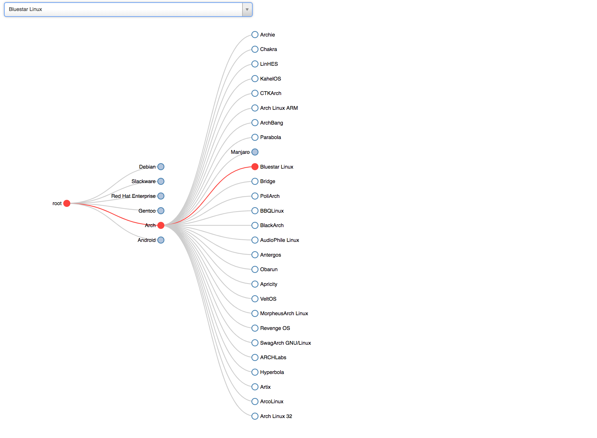

# Overview

Interactive way to explore and learn about evolution of Linux Distros

I took a CSV file representing the relationship between Linux versions, converted it into a tree, then created an interactive, searchable views of all the versions.

# Acknowledgements

CSV - https://github.com/FabioLolix/LinuxTimeline/blob/master/gldt.csv
Static Visualization - https://futurist.se/gldt/wp-content/uploads/12.02/gldt1202.svg
PBrockmann - http://bl.ocks.org/PBrockmann/0f22818096428b12ea23  
FabioLolix - https://github.com/FabioLolix/LinuxTimeline  
Futurist.se - futurist.se/gldt
